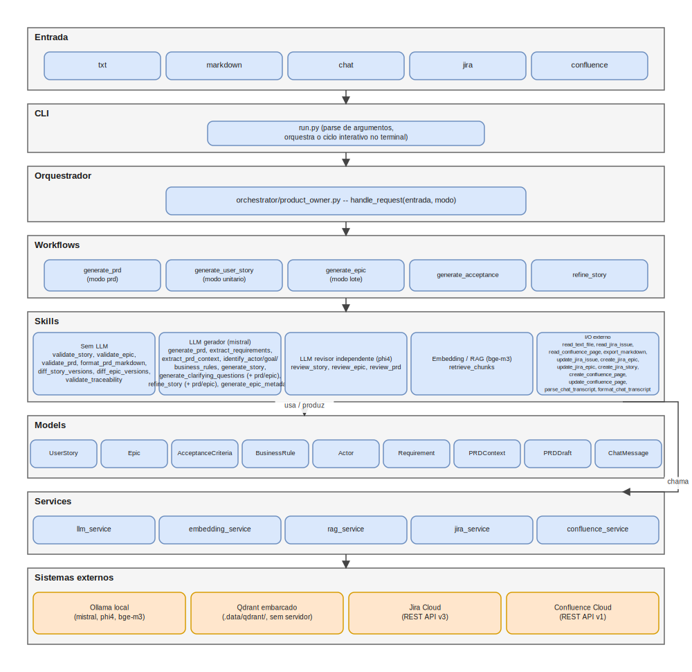
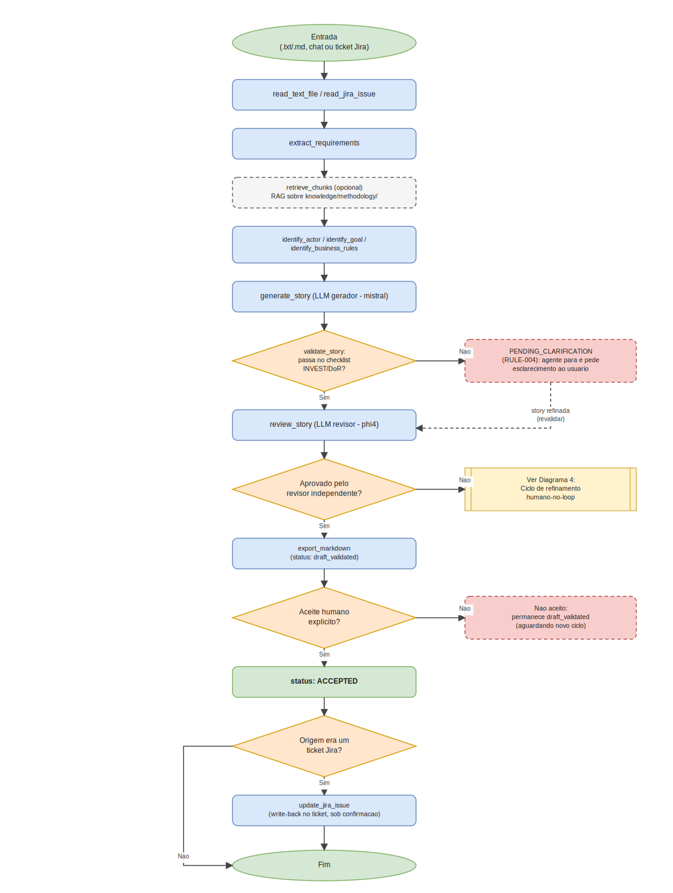
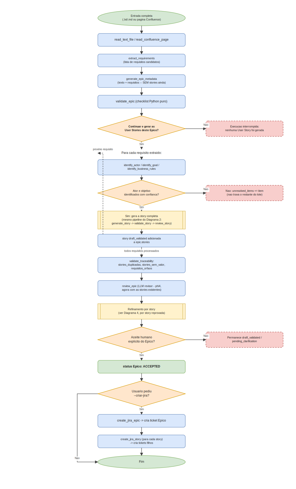
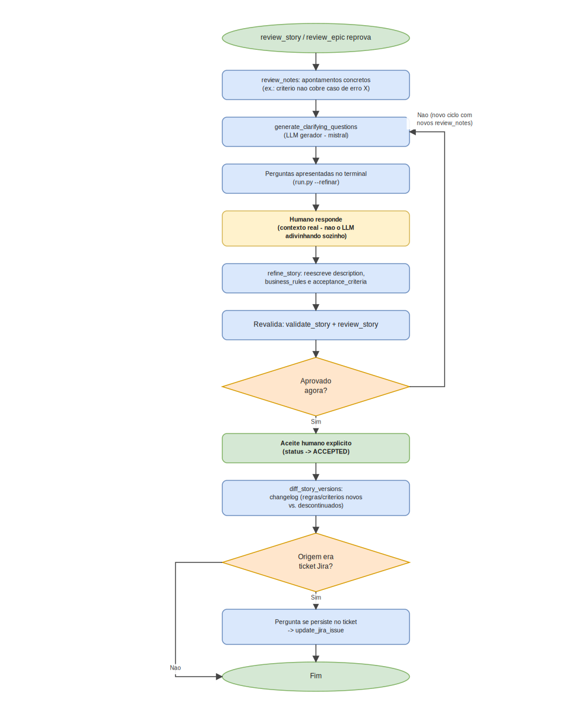
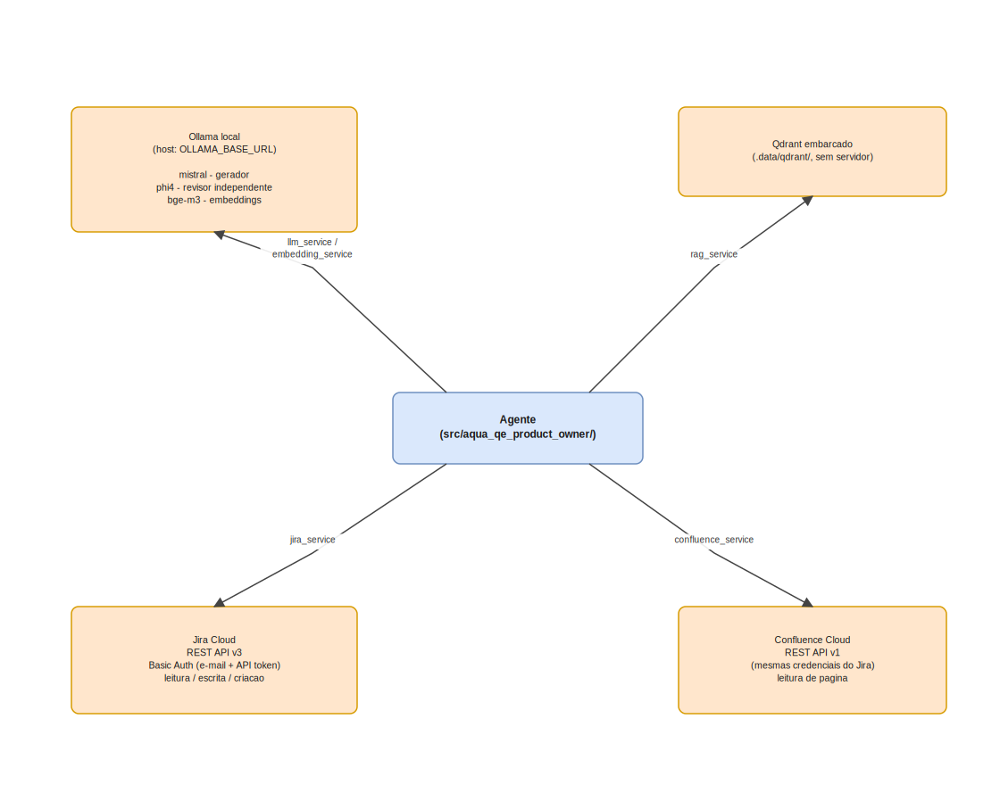

# Diagramas de arquitetura

Representação visual da arquitetura e dos fluxos do agente, complementando a documentação em prosa de `../agent/system_design.md`, `../agent/agent_design.md`, `../agent/skills.md` e `../../WHITEPAPER.md`.

- **Fonte editável**: [`architecture.drawio`](architecture.drawio) — arquivo único, 5 páginas, abra em [app.diagrams.net](https://app.diagrams.net) ou na extensão "Draw.io Integration" do VS Code.
- **Espelho estático**: `svg/*.svg` — mesmo conteúdo de cada página, visível diretamente aqui no GitHub/VS Code, sem precisar abrir o draw.io.

## 1 — Arquitetura em camadas

Da entrada (`.txt`/Markdown/chat/Jira/Confluence) até os sistemas externos, passando por CLI, orquestrador, workflows, skills, models e services. Detalhe textual em `../agent/system_design.md`.

## 2 — Fluxo modo unitário

Pipeline de uma única User Story: `Generate → Validate → Review → Refine → Approve`, com os dois pontos de checagem (checklist automático e revisor independente) antes de qualquer aceite humano. Detalhe textual em `../agent/system_design.md` e `../agent/rules.md`.

## 3 — Fluxo modo lote (Épico)

Em duas fases: primeiro `generate_epic_metadata` + `validate_epic` definem o Épico só a partir do texto e dos requisitos extraídos — **sem nenhuma story ainda** — e o usuário decide se quer continuar; só depois o mesmo pipeline do Diagrama 2 é aplicado a cada requisito, seguido de `validate_traceability` e `review_epic` (agora com as stories existentes, para avaliar coerência real).

## 4 — Ciclo de refinamento humano-no-loop

O diferencial do projeto: quando a revisão reprova, o agente gera perguntas objetivas para um humano responder — não tenta se autocorrigir sozinho. Ver seção 6 do `../../WHITEPAPER.md`.

## 5 — Integrações externas

Ollama local (`mistral`/`phi4`/`bge-m3`), Qdrant embarcado, Jira Cloud e Confluence Cloud, e qual módulo de `services/` fala com cada um.

## Mantendo `.drawio` e `.svg` sincronizados

`architecture.drawio` é a fonte editável; os `.svg` em `svg/` foram gerados como um espelho fiel de cada página, para renderizar direto no GitHub sem exigir o app do draw.io (não há CLI/app do draw.io instalado na máquina onde este diretório foi criado). Se você editar o `.drawio` no app.diagrams.net, reexporte os SVGs por lá (`File → Export as → SVG`, uma página por vez) e substitua os arquivos correspondentes em `svg/` para manter os dois em sincronia.
